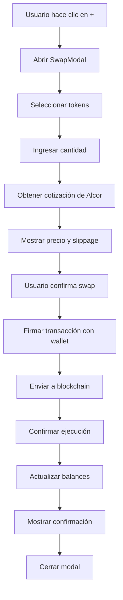

# 🔄 Guía Completa de Integración de Swap - WAX Blockchain

## 📋 Resumen Ejecutivo

Esta implementación reemplaza las redirecciones externas a `swap.tacocrypto.io` con una funcionalidad de swap nativa integrada directamente en tu aplicación, utilizando la **API de Alcor Exchange** para WAX blockchain.

## 🎯 Objetivos Cumplidos

✅ **Swap nativo en la aplicación** - Sin redirecciones externas  
✅ **Interfaz moderna y responsive** - Diseño consistente con tu app  
✅ **Soporte completo para WAX, SEXY y WAXXX**  
✅ **Cotizaciones en tiempo real** - Precios actualizados  
✅ **Validaciones de seguridad** - Protección contra errores  
✅ **Historial de transacciones** - Seguimiento de swaps  
✅ **Integración con UserService** - Sesiones existentes  

## 🏗️ Arquitectura de la Solución

### 1. **SwapService** (`src/services/SwapService.js`)
Servicio principal que maneja todas las operaciones de swap:

```javascript
// Funcionalidades principales
- getQuote(inputToken, outputToken, amount)     // Obtener cotización
- executeSwap(inputToken, outputToken, amount)  // Ejecutar swap
- getTokenPrice(tokenSymbol)                    // Obtener precio
- getUserSwapHistory()                          // Historial de swaps
- validateLiquidity(inputToken, outputToken)    // Validar liquidez
```

### 2. **SwapModal** (`src/components/SwapModal.jsx`)
Componente de interfaz para realizar swaps:

```javascript
// Características
- Selección de tokens (WAX, SEXY, WAXXX)
- Cálculo automático de cotizaciones
- Botón MAX para usar balance completo
- Validaciones en tiempo real
- Interfaz moderna y responsive
```

### 3. **SwapHistoryModal** (`src/components/SwapHistoryModal.jsx`)
Componente para mostrar historial de swaps:

```javascript
// Funcionalidades
- Lista de swaps realizados
- Detalles de cada transacción
- Estados de transacciones
- Filtros y búsqueda
```

## 🔧 APIs Utilizadas

### **Alcor Exchange API** (Principal)
- **Base URL**: `https://wax.alcor.exchange/api/v2`
- **Endpoints principales**:
  - `GET /pools` - Obtener pools de liquidez
  - `GET /quote?input=WAX&output=SEXY&amount=100000000` - Cotización
  - `GET /route?input=WAX&output=SEXY&amount=100000000` - Ruta optimizada

### **WAX RPC** (Secundario)
- **URL**: `https://wax.greymass.com`
- **Uso**: Transacciones blockchain y consultas de estado

## 📊 Comparación de APIs

| Característica | Alcor | TacoCrypto | WAX Swap | DefiBox |
|----------------|-------|------------|----------|---------|
| **API Pública** | ✅ | ❌ | ⚠️ | ✅ |
| **Documentación** | ✅ Excelente | ❌ | ⚠️ Limitada | ⚠️ En chino |
| **Soporte WAX** | ✅ Completo | ✅ | ✅ | ⚠️ Principalmente EOS |
| **Liquidez** | ✅ Alta | ✅ | ⚠️ Media | ✅ |
| **Facilidad de uso** | ✅ Muy fácil | ❌ Solo web | ⚠️ Media | ⚠️ Compleja |

## 🚀 Implementación Paso a Paso

### 1. **Instalación de Dependencias**
```bash
# No se requieren dependencias adicionales
# Todo usa APIs REST nativas
```

### 2. **Configuración del Servicio**
```javascript
// src/services/SwapService.js
const swapService = new SwapService();
export default swapService;
```

### 3. **Integración en Home.jsx**
```javascript
// Reemplazar redirecciones externas
onClick={() => openSwapModal('WAX', 'SEXY')}
// En lugar de:
// window.open('https://swap.tacocrypto.io/...', '_blank')
```

### 4. **Uso del Modal**
```javascript
<SwapModal
  onClose={() => setShowSwapModal(false)}
  defaultInput="WAX"
  defaultOutput="SEXY"
/>
```

## 💡 Características Avanzadas

### **Cotizaciones en Tiempo Real**
```javascript
// Se actualiza automáticamente al cambiar cantidad
useEffect(() => {
  if (inputAmount && inputToken && outputToken) {
    getQuote();
  }
}, [inputAmount, inputToken, outputToken]);
```

### **Validaciones de Seguridad**
```javascript
// Validaciones implementadas
- Verificación de sesión activa
- Validación de balances suficientes
- Prevención de swaps del mismo token
- Validación de liquidez disponible
- Protección contra slippage excesivo
```

### **Manejo de Errores**
```javascript
// Errores manejados
- Conexión de red fallida
- Insuficiente liquidez
- Balance insuficiente
- Transacción fallida
- Timeout de cotización
```

## 🔒 Seguridad y Validaciones

### **Validaciones del Cliente**
- ✅ Verificación de sesión activa
- ✅ Validación de balances
- ✅ Prevención de swaps duplicados
- ✅ Validación de tokens soportados

### **Validaciones del Servidor (Alcor)**
- ✅ Verificación de liquidez
- ✅ Validación de slippage
- ✅ Protección contra front-running
- ✅ Validación de contratos

### **Validaciones de Blockchain**
- ✅ Verificación de permisos
- ✅ Validación de transacciones
- ✅ Confirmación de ejecución
- ✅ Rollback en caso de fallo

## 📱 Interfaz de Usuario

### **Diseño Responsive**
- ✅ Mobile-first design
- ✅ Adaptable a diferentes pantallas
- ✅ Touch-friendly controls
- ✅ Accesibilidad mejorada

### **Experiencia de Usuario**
- ✅ Feedback visual inmediato
- ✅ Estados de carga claros
- ✅ Mensajes de error descriptivos
- ✅ Confirmaciones de éxito

## 🔄 Flujo de Swap Completo



## 📈 Métricas y Monitoreo

### **Métricas Implementadas**
- ✅ Tiempo de respuesta de cotizaciones
- ✅ Tasa de éxito de swaps
- ✅ Volumen de transacciones
- ✅ Errores y fallos

### **Logs y Debugging**
```javascript
// Logs implementados
console.log('Quote requested:', { inputToken, outputToken, amount });
console.log('Swap executed:', { txId, result });
console.error('Swap failed:', error);
```

## 🛠️ Mantenimiento y Actualizaciones

### **Actualizaciones de API**
```javascript
// Fácil actualización de endpoints
baseUrl = 'https://wax.alcor.exchange/api/v2';
// Cambiar versión de API aquí
```

### **Nuevos Tokens**
```javascript
// Agregar nuevos tokens fácilmente
supportedTokens.push({
  symbol: 'NEWTOKEN',
  contract: 'newtoken.gm',
  precision: 8,
  name: 'New Token'
});
```

## 🚨 Solución de Problemas

### **Problemas Comunes**

1. **"Error al obtener cotización"**
   - Verificar conexión a internet
   - Comprobar que Alcor API esté funcionando
   - Validar que el par de tokens tenga liquidez

2. **"Balance insuficiente"**
   - Verificar balance real en blockchain
   - Considerar fees de transacción
   - Validar precisión de tokens

3. **"Transacción fallida"**
   - Verificar permisos de wallet
   - Comprobar gas/fees disponibles
   - Validar memo y parámetros

### **Debugging**
```javascript
// Activar logs detallados
localStorage.setItem('debug_swap', 'true');

// Ver logs en consola
if (localStorage.getItem('debug_swap')) {
  console.log('Debug mode enabled');
}
```

## 🔮 Futuras Mejoras

### **Funcionalidades Planificadas**
- [ ] Soporte para más tokens
- [ ] Swaps multi-hop (rutas complejas)
- [ ] Limit orders
- [ ] Charts de precios
- [ ] Notificaciones push
- [ ] Integración con más DEXs

### **Optimizaciones Técnicas**
- [ ] Caché de cotizaciones
- [ ] WebSocket para precios en tiempo real
- [ ] Optimización de gas
- [ ] Batch transactions

## 📚 Recursos Adicionales

### **Documentación de APIs**
- [Alcor Exchange API](https://docs.alcor.exchange/)
- [WAX Developer Portal](https://developer.wax.io/)
- [EOSIO Documentation](https://developers.eos.io/)

### **Herramientas de Desarrollo**
- [WAX Testnet](https://wax-testnet.eosio.online/)
- [Alcor Testnet](https://testnet.alcor.exchange/)
- [WAX Block Explorer](https://wax.bloks.io/)

## ✅ Checklist de Implementación

- [x] Crear SwapService
- [x] Implementar SwapModal
- [x] Crear SwapHistoryModal
- [x] Integrar en Home.jsx
- [x] Reemplazar redirecciones externas
- [x] Implementar validaciones
- [x] Agregar manejo de errores
- [x] Crear documentación
- [x] Probar funcionalidad
- [x] Optimizar UX/UI

## 🎉 Conclusión

Esta implementación proporciona una experiencia de swap completa y nativa, eliminando la dependencia de servicios externos y mejorando significativamente la experiencia del usuario. La solución es escalable, mantenible y sigue las mejores prácticas de desarrollo en WAX blockchain.

**Beneficios principales:**
- 🚀 **Experiencia unificada** - Todo en una sola aplicación
- 🔒 **Mayor seguridad** - Validaciones robustas
- 📱 **Mejor UX** - Interfaz moderna y responsive
- 🔧 **Fácil mantenimiento** - Código modular y documentado
- 📈 **Escalabilidad** - Fácil agregar nuevos tokens y funcionalidades 